# Post /users

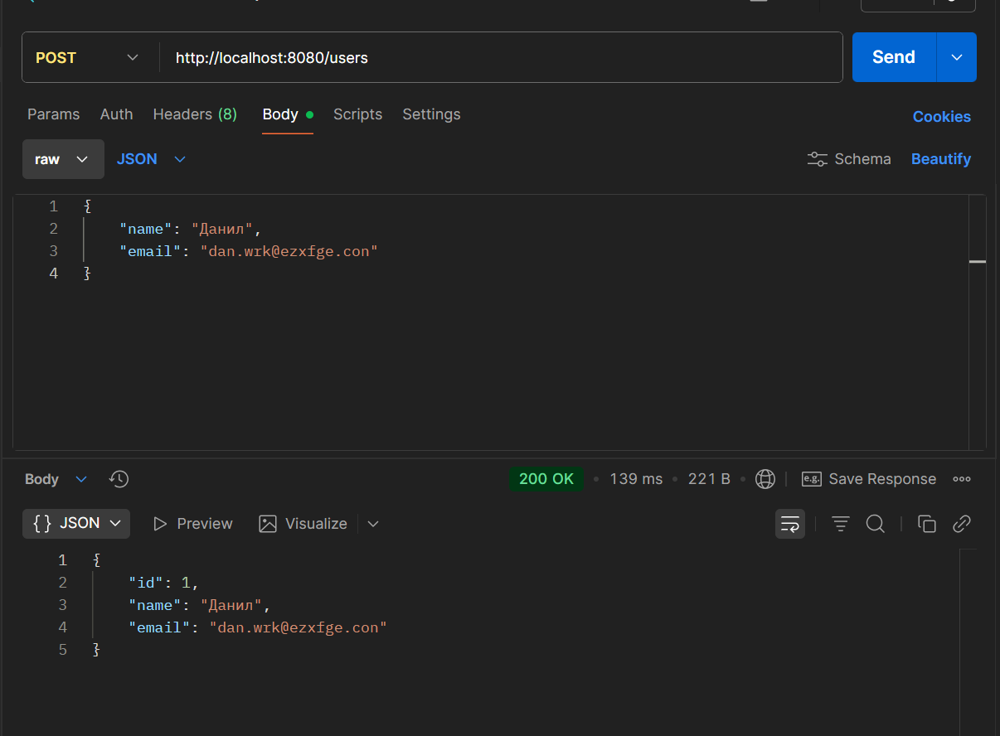

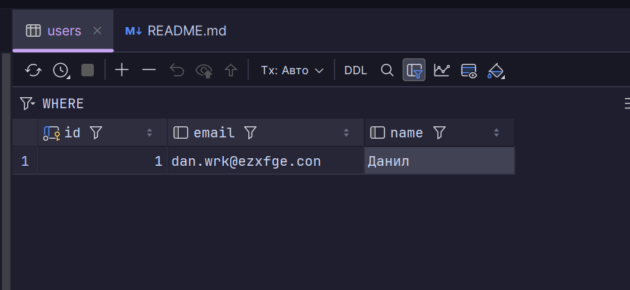

# Get /users (all)

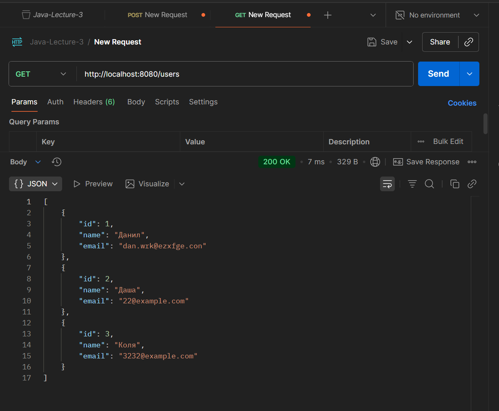

# Get /users/{id}

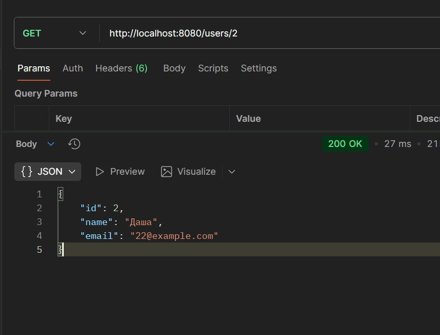

# Put

## Было:

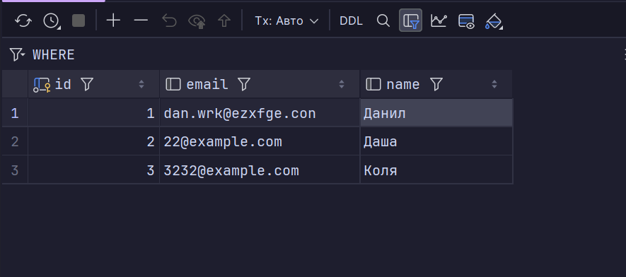

## Request и Responce

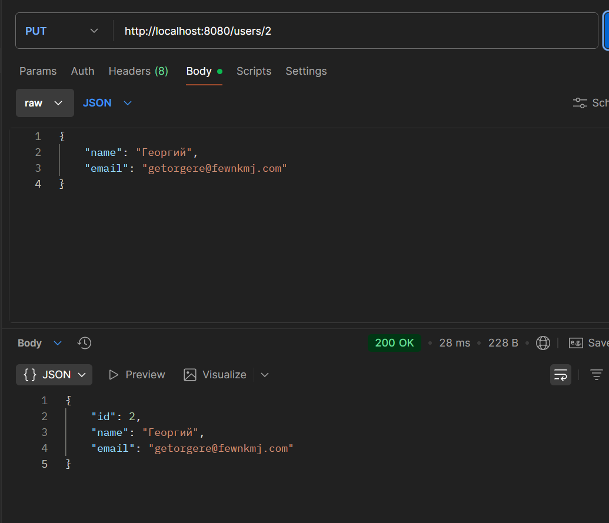

# Стало:

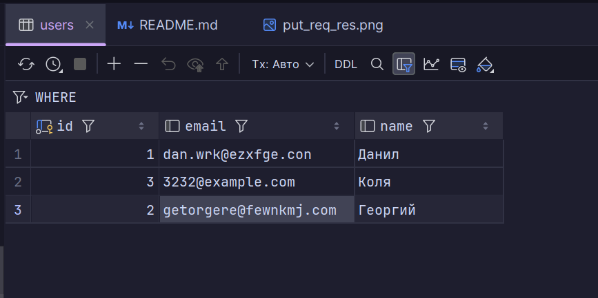

# Delete

## Request
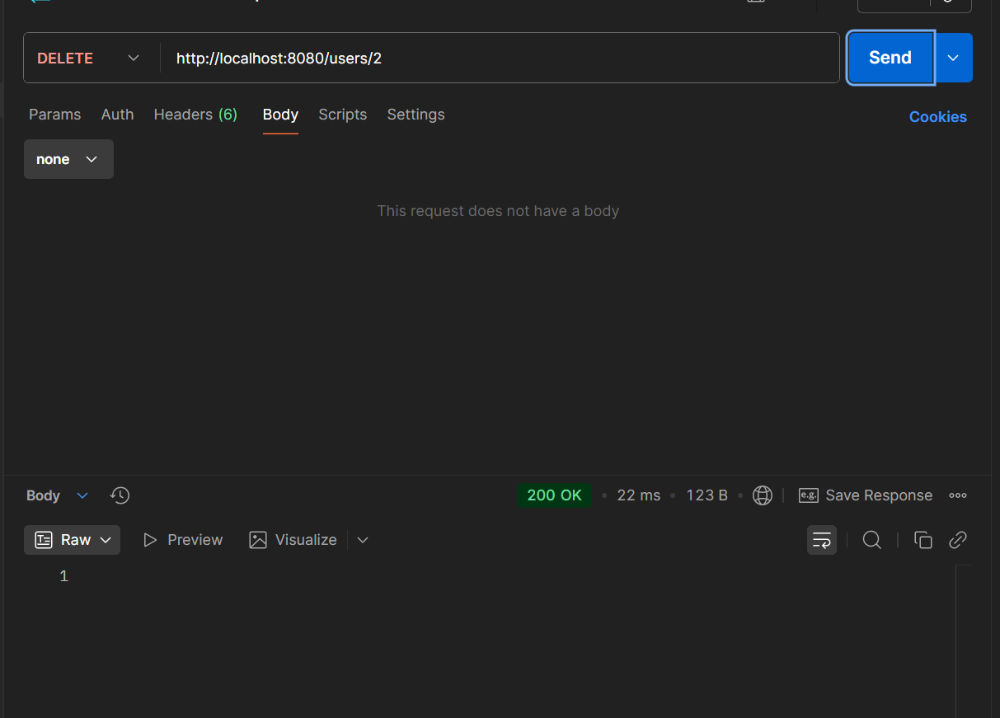

## Стало в postgre

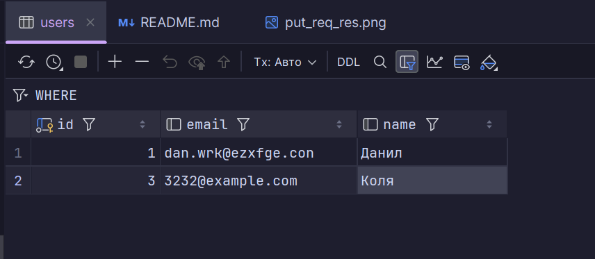

# Events

---

## Создание ивента:

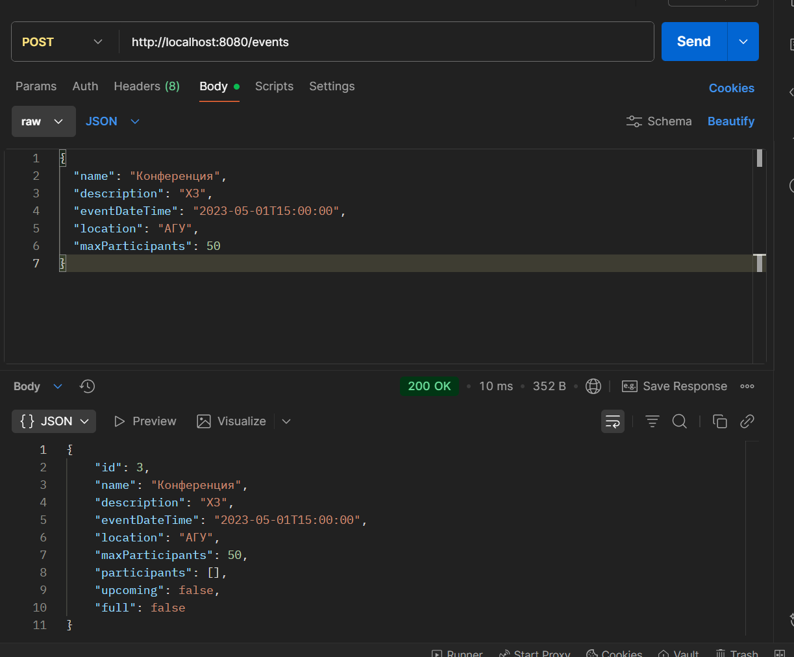

### Результат:

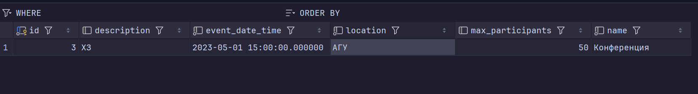

## Запись на ивент:

### Запись на прошедший ивент

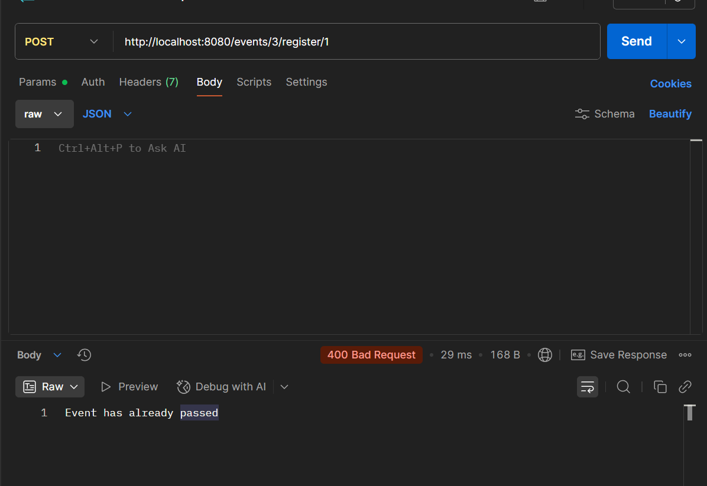

### Запись на предстоящий ивент

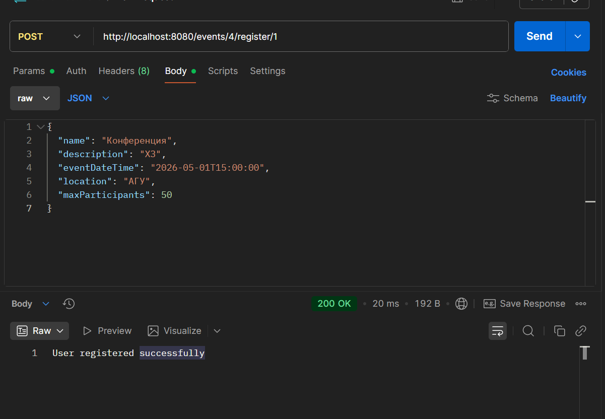

Также создается запись в many-to-many таблице

event to user

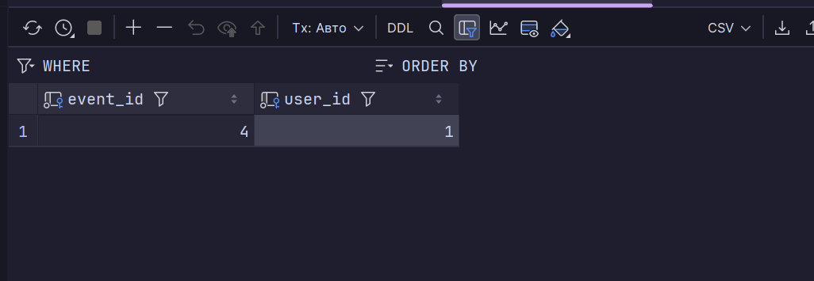

За